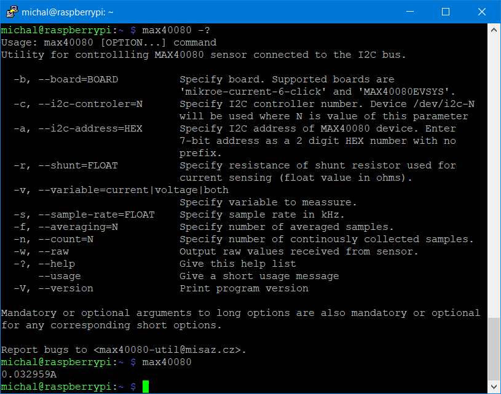

# MAX40080 CLI Utility
This project contains CLI utility for controlling Maxim Integrated MAX40080 Current Sense Amplifier connected to he computer over I2C. Utility is designed for use with SBCs like Raspberry Pi.

# Instalation

```
wget 'https://github.com/misaz/MAX40080-CLI/releases/download/v1.0/max40080_aarch64'
sudo mv max40080_aarch64 /usr/bin/max40080
sudo chmod +x /usr/bin/max40080
```

# Basic usage

```
max40080
```



# Advanced usage
```
# Measure voltage instead of current
max40080 -v voltage

# Measure both current and voltage
max40080 -v both

# Collect multiple consecutive samples
max40080 -v both -n 5

# Collect samples indefinitely
max40080 -v both -n -1

# Print raw value from sensor
max40080 -w

# Adjust ADC sample rate (468.5 kHz)
max40080 -s 468.5

# Enable digital filter (averaging among 64 samples)
max40080 -f 64

# Use with MAX40080EVSYS instead of MikroE Current 6 Click Board
max40080 -b MAX40080EVSYS

# Use with custom board (onboard shunt resistor is 33 miliohms, i2c address is set to 0x29)
max40080 -a 29 -s 0.033
```

# Compiling From Sources

```
sudo apt update
sudo apt -y install git gcc make libi2c-dev
git clone https://github.com/misaz/MAX40080-CLI.git
cd MAX40080-CLI
make
make install
cd -
```
